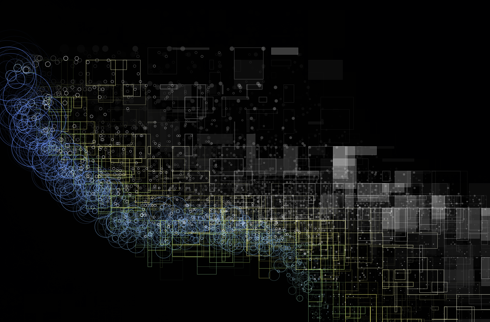

Visualization art using p5.js based on the sound of waves
=========================================================

This p5 sketch visualizes the sound of waves of the sea recorded at Yuigahama in Kamakura, which is processed with FFT.

## Sketches

### #1 Sound spectrum visualizer


[See video on YouTube](https://www.youtube.com/watch?v=mBPAtibRb1E)

### #2 Raindrop


[See video on YouTube](https://www.youtube.com/watch?v=LMBx6AYaRXc)

## Usage

### Install http server

If you don't have any http server, install `simplehttpserver` from npm:

```
npm -g simplehttpserver -g
```

### Launch http server

```
git clone git@github.com:noradaiko/p5-wave-visualization.git
cd p5-wave-visualization
simplehttpserver ./
```

### Open on web browser

#### #1 Sound spectrum visualizer

```
http://localhost:8000/fft
```

#### #2 Raindrop

```
http://localhost:8000/wave
```

